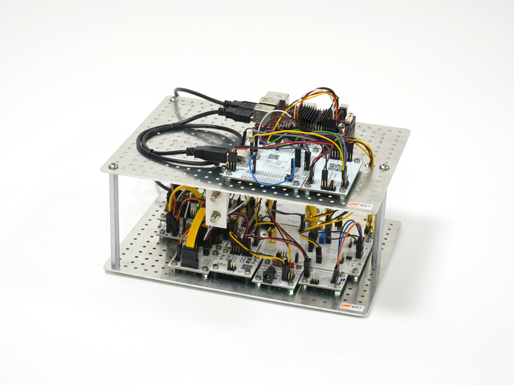

# Radio Meteor Detection Station RMDS02F

The Radio Meteor Detection Station RMDS02F is a state-of-the-art system utilizing a software-defined radio (SDR) receiver set specifically configured for the detection of meteor trails using radio signals. The primary source of detection signals is the military GRAVES radar, which offers superior stability and power output, enabling effective meteor detection across nearly all of Europe. The station does not need any maitanance. The only requirement is power supply and internet connection on the observation site. 

## Features

- **Software-Defined Radio (SDR)**: The core of the RMDS02F is its SDR receiver, which allows for advanced signal processing techniques to be applied, enhancing detection capabilities.
- **GPS Synchronization**: The system includes GPS time and frequency synchronization which aids in determining inter-station reflection variations and the Doppler shift of the detected signals.
- **Enhanced Power Supply**: The station's power supply system has been upgraded to ensure reliable and consistent operation.
- **Single Board ARM Computer**: The station utilizes a single board ARM computer to process data and manage the detection system.
- **SDR-Widget Digitalization**: Signals are digitized using an SDR-Widget, ensuring high-quality data capture for advanced analysis.

## Advantages of Using GRAVES Radar

Utilizing the GRAVES military radar signal provides several advantages over traditional methods that use TV transmitters for meteor detection:
- **High Stability and Reliability**: The military-grade transmission offers unmatched signal stability and consistency.
- **Powerful Transmission**: With its enormous power output, the GRAVES radar system can cover a vast geographic area, making it possible to detect meteors throughout Europe.

## Description

The RMDS02F is an advanced radio meteor trail detection system. It is designed for accurate and efficient detection of meteors by utilizing the reflective properties of meteor trails in the upper atmosphere. The integration of GPS provides time and frequency stabilization that is crucial for analyzing inter-station signal variations and capturing Doppler shifts in the meteor trail reflections.

For further information and updates, please refer to the [Bolidozor documentation](https://wiki.bolidozor.cz/doku.php?id=en:rmds).
